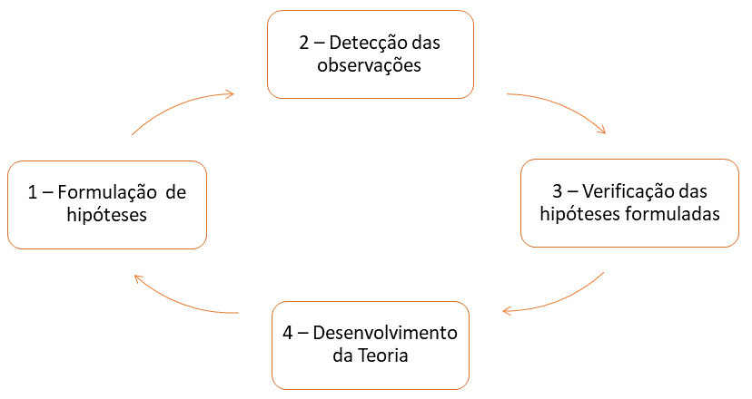

# Introdução ao estudo de experimentação

Numa pesquisa científica, o precedimento geral é formular hipóteses e verificá-las diretamente ou por suas consequências.

Para isso é preciso um conjunto de observações e o planejamento de experimentos é, então, essencial para indicar o esquema sob o qual as hipóteses possam ser verificadas com a utilização de métodos de análise estatística os quais dependem da maneira em que as observações foram obtidas.

Portanto, o planejamento de experimentos e análises dos resultados, estão intimamente ligados e devem serutilizados em uma sequência nas pesquisas científicas das diversas áreas do conhecimento.

Isto pode ser ilustrado por meio da representação gráfica da circularidade do método científico.

```{r echo=FALSE, fig.cap="Circularidade do método científico.",fig.align='center',out.width = "1000px"}

```

