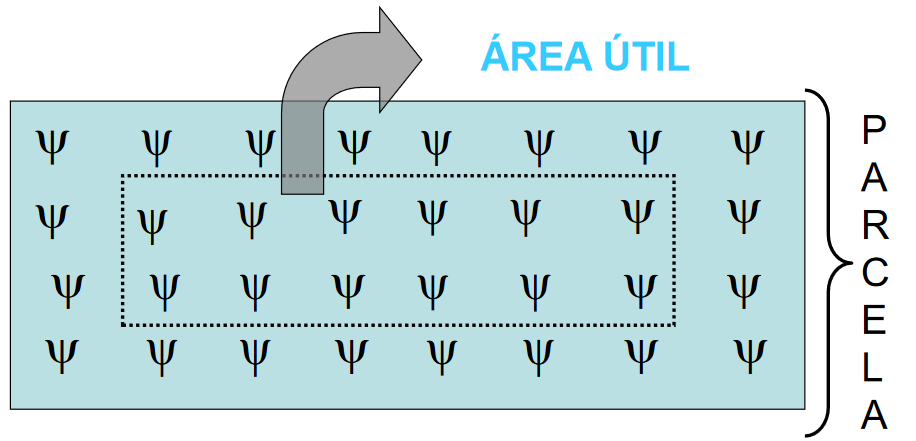
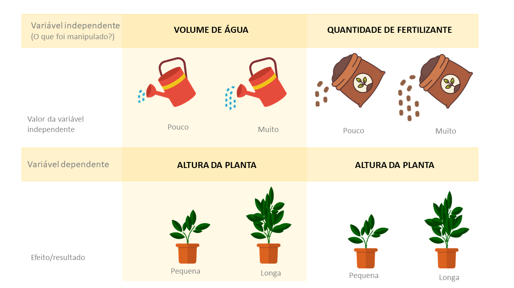

# Introdução ao estudo de experimentação

Numa pesquisa científica, o precedimento geral é formular hipóteses e verificá-las diretamente ou por suas consequências.

Para isso é preciso um conjunto de observações e o planejamento de experimentos é, então, essencial para indicar o esquema sob o qual as hipóteses possam ser verificadas com a utilização de métodos de análise estatística os quais dependem da maneira em que as observações foram obtidas.

Portanto, o planejamento de experimentos e análises dos resultados, estão intimamente ligados e devem serutilizados em uma sequência nas pesquisas científicas das diversas áreas do conhecimento.

Isto pode ser ilustrado por meio da representação gráfica da circularidade do método científico.

```{r echo=FALSE, fig.cap="Circularidade do método científico.",fig.align='center',out.width = "1200px"}
knitr::include_graphics("img/circularidade.png")
```

Fica evidente nesse esquema que as técnicas de planejamento devem ser utilizadas entre as etapas $(1)$ e $(2)$ e os métodos de análise estatística devem ser utilizados na etapa $(3)$.

Agora vamos desenvolver um pouco mais esta ideia, assim, podemos dizer que uma pesquisa científica, **estatisticamente planejada**, deve conter as seguintes etapas.


1. Enunciado do problema com elaboração de hipótese.
  
2. Escolha dos fatores (variáveis independentes) que devem ser incluídos no estudo.

3. Escolha da unidade experimental e da unidade de observação.

4. Escolha das variáveis que serão medidas na unidades observacionais.

5. Determinação das regras e procedimentos pelos os quais os diferentes tratamentos serão atribuídos às unidades experimentais.

6. Análise estatística dos resultados

7. Relatório final contendo conclusões com medidas de precisão das estimativas, interpretação dos resultados, com possíveis referências a outras pesquisas similares e uma avaliação dos itens $1$ a $6$ com sugestões para possíveis alterações em pesquisas futuras.

A seguir será apresentada uma ilustração destas etapas com exemplos.

## Enunciado do problema

Como vimos, uma pesquisa científica inicia-se sempre com formulações de hipóteses. Essas hipóteses são primeiramente formuladas em termos científicos dentro da área de estudo (hipótese científica) e em seguida devem ser expressas em termos estatísticos (hipótese estatística). 

Nesse sentido, deve haver uma correspondência perfeita entre as hipóteses científicas e estatísticas para evitar ambiguidade.

De acordo com @StatforExp2005, é possível conduzir uma investigação sem a formulação de uma hipótese estatística, mas impossível fazê-lo sem conhecimento do assunto, ou seja a formulação de uma hipótese científica. No entanto, usando métodos estatísticos, a convergência para uma solução é acelerada e um bom investigador se torna um ainda melhor.

Assim, no enunciado do problema a hipótese científica deve ser formulada de maneira precisa e objetiva. Por exemplo:

  > Um pesquisador está interessado em estudar o efeito de vários adubos, que diferem pela quantidade de nitrogênio, na produção de uma determinada cultura.

Esse objetivo pode ser atingido se planejarmos a pesquisa como uma das seguintes finalidade:

  * comparar as médias da produção da cultura obtidas com cada um dos adubos **(igualdade da médias)**.
  
  * estabelecer uma relação funcional entre a produção da cultura e a quantidade de nitrogênio.


## Escolha dos fatores e seus respectivos níveis

No exemplo anterior a variável independente "adubo" é um **fator** e os tipos de adubos são os **níveis** deste fator ou tratamentos.


Assim, em um experimento para se estudar o efeito de $4$ adubos e $3$ espaçamentos de plantio na produção de uma cultura teríamos dois fatores: adubos com $4$ níveis e espaçamentos com $3$ níveis.

Podemos dizer que este experimeto envolve $12$ tratamentos correspondentes às combinações dos níveis dos dois fatores.

Pelo próprio conceito de fator, vemos que em um experimento a escolha dos fatores e seus respectivos níveis é basicamente um problema do pesquisador. No entanto, é importante para o planejamento e análise distinguirmos as duas situações a seguir.

> **a)** Uma fazenda de produção de leite adquire $5$ vacas de uma determinada raça para a produção de leite e está interessada em realizar um exprimento para verificar se as 5 vacas são homogêneas quanto a produção de leite.

> **b)** A mesma fazenda de produção de leite está interessada em realizar um experimento para verificar se a produção de leite de vacas de uma determinada raça é homogênea. Como a população desta raça é muito grande, o pesquisador decidiu realizar o experimento com uma amostra de $5$ vacas, mas as conclusões devem ser estendidas para a população de vacas.

No exemplo **a** dizemos que o fator "vaca" é <span style="background-color:white; color:#a41a1a;
font-family:Georgia; font-size:1.5em;"> fixo </span> e no exemplo **b** o fator vaca é <span style="background-color:white; color:#a41a1a;
font-family:Georgia; font-size:1.5em;"> aleatório </span>

A diferença fundamental nestes dois tipos de experimentos é, então, que no caso de fatores <span style="background-color:white; color:#a41a1a;
font-family:Georgia; font-size:1.5em;"> fixo </span>, as conclusões se referem apenas aos níveis do fatorque estçao presentes no experimento. No caso de fatores <span style="background-color:white; color:#a41a1a;
font-family:Georgia; font-size:1.5em;"> aleatórios </span> as conclusões devem ser estendidas para a população de níveis.


## Escolha de Unidade experimental

A **unidade experimental** É a menor unidade de um experimento na qual é aplicado um tratamento. Deve ter tamanho suficiente para reproduzir manejo similar ao empregado na prática e captar as variabilidades existentes. A parcela pode ser uma área de campo, um animal, um curral, uma placa de Petri, um tubo de ensaio, uma planta, ou grupo de animais, uma máquina, etc.

Em grandes números de situações práticas, a unidade experimental é determinada pela própria natureza do material experimental, por exemplo, com animal, em geral a unidade experimental é um animal, ja no caso de experimentos de campo com culturas agronômicas é usual unidades experimentais retangulares com a maior dimensão no sentido da linha de plantio da cultura. Em outras situações práticas a escolha de uma unidade experimental não é tão evidente, exigindo do pesquisador juntamente com o estatístico algum estudo no sentido de escolher a unidade experimental mais adequada.

A escolha da unidade experimental, de um modo geral, deve ser orientada no sentido de minimizar o erro experimental, isto é, as unidades experimentais devem ser o mais homogêneas possível, para que quando submetidas a dois tratamentos diferentes, seus efeitos sejam facilmente detectados.

No caso de experimentos de campo, no geral é conveniente que a parcela possua bordadura para evitar efeitos de borda como luminosidade, efeitos de parcelas vizinhas, entre outras.  

Ideal: separar a Bordadura e colher somente materiais da área útil da parcela, o que é difícil praticamente.

```{r echo=FALSE, fig.cap="Representação esquemática  de uma unidade experimental destacando a área útil da parcela.",fig.align='center',out.width = "1200px"}

```

## Escolha das variáveis a serem medidas

As medidas realizadas nas unidades experimentais, após terem sido submetidas aos tratamentos, constituem os valores da <span style="background-color:white; color:#a41a1a;
font-family:Georgia; font-size:1.5em;"> variável dependente </span>. 

A *variável dependente* em geral é pré-determinada pelo pesquisador, isto é, ele sabe qual variável, ou variáveis, que se deve medir. O que constitui problema, as vezes, é a maneira como a variável é medida, pois disto dependem a precisão das observações e a distribuição de probabilidade da variável a qual é essencial para a escolha do método de análise. 

Assim, se os valores de uma variável são obetidos diretamente de um aparelho de medida (régua, balança, termômetro, anemômetro, etc) a precisão das observações vai aumentar se, quando possível, utilizarmos como observação a média de $3$ medidas da mesma unidade experimental.

Com relação à distribuição e probabilidade, em muitas situações, as observações não são obtidas diretamente e sim por expressões matemáticas que as ligam com outros valores obtidos diretamente. Neste caso, a distribuição de probabilidade da variável vai depender da distribuição de probabilidade da variável obtida diretamente e da expressão matemática que as relacionam.

```{r echo=FALSE, fig.cap="Variáveis dependentes e indepentes para o crescimento inicial de plantas.",fig.align='center',out.width = "1200px"}

```

Portanto, as variáveis necessariamente presentes em um experimento são as variáveis dependentes medidas nas unidades experimentais, e o conjunto de fatores ( <span style="background-color:white; color:#a41a1a;
font-family:Georgia; font-size:1.5em;"> variáveis independentes </span>) que determinam as condições sob as quais os valores de tais variáveis dependentes são obtidos.

Qualquer outra variável que possa influir nos  valores das variáveis dependentes deve ser mantida constante.


## Regras segundo as quais os tratamentos são atribuidos às unidades experimentais
