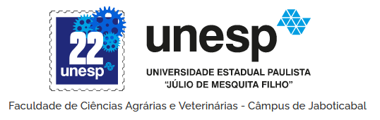

--- 
title: "Experimentação Agrícola"
author: "Alan R. Panosso <alan.panosso@unesp.br>"
date: "`r Sys.Date()`"
site: bookdown::bookdown_site
documentclass: book
bibliography: [book.bib, packages.bib]
# url: your book url like https://bookdown.org/yihui/bookdown
# cover-image: path to the social sharing image like images/cover.jpg
description: "Disciplina ministrada aos primeiros semestres de cada ano no curso de Graduação e Pós-graduação em Agronomia (Ciência do Solo e Genética e Melhoramento de Plantas) da Faculdade de Ciências Agrárias e Veterinárias (FCAV) da UNESP de Jaboticabal."
link-citations: yes
github-repo: rstudio/bookdown-demo
---

# Bem-vindos!! {-}
```{r echo=FALSE, out.width = "300px"}

```

# Histórico e Justificativa

O Departamento de Engenharia e Ciências Exatas ([DECEx](https://www.fcav.unesp.br/#!/engenharia)), por mais de $40$ anos, tem demonstrado competência nas linhas de pesquisa em Estatística, Física, Informática, Matemática e Agrometeorologia, conferindo excelência ao campus da Unesp – Jaboticabal. 

O DECEx participa ativamente na formação de alunos dos cursos de graduação, não somente pelas disciplinas oferecidas, mas também pelas orientações em Iniciação Científica, Trabalhos de Conclusão de Curso, Teses e Dissertações e inúmeros artigos publicados em revistas e eventos nacionais e internacionais.

O DECEx presta serviços à comunidade (unespiana e externa ao câmpus), por meio de assessoria e consultoria nas áreas de estatística aplicada, informática, matemática e agrometeorologia, além de oferecer cursos (temáticos, difusão de conhecimento e aperfeiçoamento) e palestras nas referidas áreas. Em $2016$ o DECEx contava com $14$ docentes, $5$ Titulares, $3$ Livre Docentes e $6$ Assistentes Doutores. 

Atualmente, em vista das aposentadorias e junção entre departamentos ocorridos na unidade, o departamento conta com $19$ docentes, ($3$ Titulares, $6$ Livre Docentes e $10$ Assistentes Doutores) sendo que $15$ docentes estão credenciados em Programas de Pós-Graduação da UNESP (Administração, Agronomia, Medicina Veterinária e Zootecnia), todos reconhecidos pela CAPES.  

Assim, é oportuna a abertura do Concurso para professor Adjunto visando a manutenção da qualificação do quadro do departamento, devido às crescentes demandas em aulas, orientações e mérito do DECEx nas solicitações de bolsas e projetos de pesquisa junto aos órgãos de fomento. A titulação do professor em **Adjunto** determina seu engajamento em grupos de pesquisa consolidados na Universidade, com linhas de pesquisa afins, as quais têm sido bem avaliadas junto aos pares. Em consequência, a qualificação docente incrementa sua participação em cargos e/ou órgãos de gestão na Unidade e/ou na Universidade, além das atividades fins na extensão, papel este primordial para a Instituição na contrapartida para a sociedade. 

A disciplina de **Experimentação Agrícola** faz parte do quadro de disciplinas do Curso de Graduação em Engenharia Agronômica e compõem o conteúdo básico de disciplinas da Pós-Graduação da FCAV/UNESP que configuram uma abordagem da Grande Área de Ciências Exatas, demonstrando a relevância que a realização do concurso tem para o departamento em questão. A Estatística Experimental está presente em diversas linhas de pesquisa, tais como, genética e melhoramento de plantas, entomologia agrícola, produção vegetal e ciência do solo. Assim, entende-se que seja justificável a abertura do Concurso de professor Adjunto que atenda o DECEx, a Unidade e a Universidade/Sociedade, na qualificação de seus profissionais.


```{r include=FALSE}
# automatically create a bib database for R packages
knitr::write_bib(c(
  .packages(), 'bookdown', 'knitr', 'rmarkdown'
), 'packages.bib')
```
